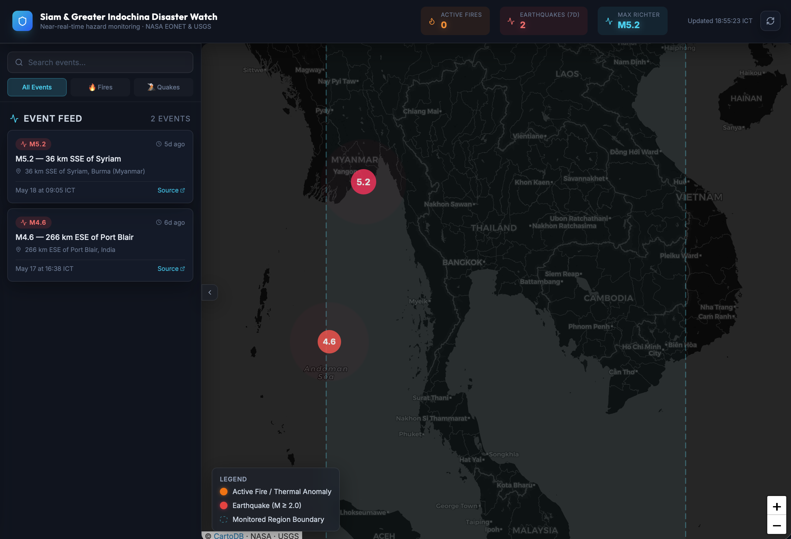

# Thailand Natural Disasters Alert


[](https://nextjs.org/)
[](https://reactjs.org/)
[](https://www.typescriptlang.org/)
[](https://tailwindcss.com/)
[](https://vercel.com/)
[](https://eonet.gsfc.nasa.gov/)
[](https://earthquake.usgs.gov/)

</br>
<div align="center">
  <a href="https://vercel.com/natthakitt-prapunwattanas-projects/thailand-natural-disasters-alert">
    
  </a>
</div>
</br>

**Near-real-time monitoring of wildfires and earthquakes across Thailand, Myanmar, Laos, Cambodia, Vietnam, and Malaysia.**

Powered by NASA EONET satellite thermal anomaly data and USGS seismic event feeds, with instant Discord push notifications for new threats.

<p align="center">
  
</p>

---

## ✨ Key Features

### 🗺️ Interactive Leaflet Map
- **Dark CartoDB tile layer** centered on the Greater Indochina region (`95°E–107.5°E`, `4°N–22.5°N`)
- **Fire markers** — pulsing orange radial rings for active wildfires and thermal anomalies from NASA MODIS/VIIRS satellite data
- **Seismic markers** — size-scaled circles (M2+ earthquakes) with magnitude label, color-coded by intensity
- **Region boundary** — dashed cyan overlay showing the monitored bounding box
- **Click-to-select** — clicking a marker flies the map to that location and opens a styled popup with full event details

### ⏰ Automated Alert Pipeline
- **Vercel-compatible `/api/check-disasters`** endpoint — receives cron calls every 15 minutes from [cron-job.org](https://cron-job.org)
- **Dual-data-source fetch** — queries USGS (45-min sliding window, M2+) and NASA EONET (active fires, bbox-filtered) in parallel with `Promise.allSettled`
- **Graceful degradation** — if one API fails or times out, the other still returns results; the endpoint never 502s on partial failure
- **Rich Discord embeds** — color-coded (orange 🔥 for fire, red ⚠️ for quake), with location, local ICT time, magnitude, depth, coordinates, and source link
- **Test mode** — `?test=1` flag sends a fake M4.2 Gulf of Thailand alert to verify Discord webhook connectivity

### 📊 Event Dashboard
- **Live stat counters** — Active Fires, Earthquakes (7d), Max Richter — update every 5 minutes
- **Collapsible sidebar** — searchable event feed with type filter pills (All / 🔥 Fires / 🌋 Quakes)
- **Event cards** — relative time, location, source link, color-coded type badge
- **Auto-refresh** — polls `/api/events` every 5 minutes with `useTransition` for non-blocking UI updates

### 🌐 API Endpoints

| Endpoint | Method | Description |
| :--- | :--- | :--- |
| `/api/events` | GET | Serves all active fires + 7-day M2+ quakes for the map, sorted by timestamp |
| `/api/check-disasters` | GET | Cron target — fetches live USGS/EONET data, sends Discord alerts if new events found |
| `/api/check-disasters?test=1` | GET | Sends a test embed to verify Discord webhook is working |

<br/>

---

## 🛠️ Technical Stack

| Layer | Technology |
| :--- | :--- |
| **Framework** | Next.js 16 (App Router, Turbopack) |
| **UI** | React 19, TypeScript, Tailwind CSS 4, Lucide Icons |
| **Map** | Leaflet.js + React-Leaflet (SSR-disabled, client-only) |
| **Styling** | CSS custom properties, glassmorphism panels, `@tailwindcss/postcss` |
| **Backend** | Next.js Route Handlers (Edge-compatible) |
| **Scheduler** | cron-job.org (every 15 mins) → `/api/check-disasters` |
| **Alert Channel** | Discord Webhooks |
| **Deployment** | Vercel (GitHub-triggered auto-deploy) |

---

## 🚀 Getting Started

### Prerequisites
- Node.js 20+
- npm or bun

### Local Setup

```bash
# Clone the repository
git clone https://github.com/mingnatthakitt/Thailand-Natural-Disasters-Alert.git
cd Thailand-Natural-Disasters-Alert

# Install dependencies
npm install

# Start development server
npm run dev
# → http://localhost:3000
```

### Environment Variables

Create a `.env.local` file (never commit this):

```env
# Discord webhook — get from Discord channel → Integrations → Webhooks
DISCORD_WEBHOOK_URL=https://discord.com/api/webhooks/...

# Optional: Upstash Redis for server-side caching
UPSTASH_REDIS_REST_URL=https://...
UPSTASH_REDIS_REST_TOKEN=...
```

> The app works fully without Redis — the `/api/events` endpoint fetches live on each request with a 5-minute browser-level cache via Next.js `revalidate`.

---

## ⚙️ Configuration

### Region Bounding Box

The monitored region covers six nations. Edit `src/lib/api-types.ts` to adjust:

```typescript
export const REGION = {
  minLat: 4.0,   // Southern Malaysia
  maxLat: 22.5,   // Northern Myanmar/Laos border
  minLng: 95.0,   // Western Myanmar (Andaman Sea)
  maxLng: 107.5,  // Eastern Laos/Vietnam border
} as const;
```

### Alert Thresholds

| Setting | Default | Location |
| :--- | :--- | :--- |
| **Earthquake minimum magnitude** | M2.0 | `src/app/api/check-disasters/route.ts` — `minmagnitude=2` |
| **Earthquake time window (cron)** | 45 minutes | same — `Date.now() - 45 * 60 * 1000` |
| **Earthquake time window (map)** | 7 days | `src/app/api/events/route.ts` |
| **Fetch timeout** | 8 seconds | `AbortSignal.timeout(8000)` in both routes |
| **Auto-refresh interval** | 5 minutes | `src/components/Dashboard.tsx` — `setInterval(fetchEvents, 5 * 60 * 1000)` |

### cron-job.org Setup

1. Create an account at [cron-job.org](https://cron-job.org)
2. Create a new cron job:
   - **URL**: `https://thailand-natural-disasters-alert.vercel.app/api/check-disasters`
   - **Schedule**: `*/15 * * * *`
   - **Method**: `GET`
3. No headers or authorization needed — the endpoint has no auth to keep cron calls simple

---

## 📁 Project Structure

```text
src/
├── app/
│   ├── api/
│   │   ├── events/           # GET /api/events — map data endpoint
│   │   └── check-disasters/  # GET /api/check-disasters — cron target + Discord alerts
│   ├── layout.tsx            # Root layout, Google Fonts (Inter, Outfit)
│   ├── page.tsx              # → Dashboard
│   └── globals.css           # CSS variables, glassmorphism, Leaflet overrides, animations
├── components/
│   ├── Dashboard.tsx         # Main layout: header stats, sidebar, map container
│   ├── EventSidebar.tsx      # Searchable, filterable event feed
│   └── MapContainer.tsx       # Leaflet map with fire + earthquake markers
├── lib/
│   └── api-types.ts          # Shared REGION, isInRegion(), toICT(), USGS/EONET types
└── types/
    └── events.ts             # UnifiedDisasterEvent + EventsAPIResponse interfaces
```

---

## ☁️ Deployment

### Vercel (Recommended)

1. Push code to GitHub
2. Import project in [Vercel Dashboard](https://vercel.com/new)
3. Add environment variables:
   - `DISCORD_WEBHOOK_URL`
4. Deploy — Vercel auto-builds on every push to `main`

> **Important**: Set the **Framework Preset** to `Next.js` in Vercel project settings. If it's set to "Other", routing won't work.

---

## ⚠️ Disclaimer

*This platform is for informational and monitoring purposes only. Earthquake and wildfire data is sourced from public APIs (NASA EONET, USGS) and may have latency. Do not use this tool as the sole source for emergency decision-making.*
